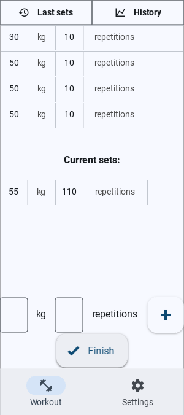
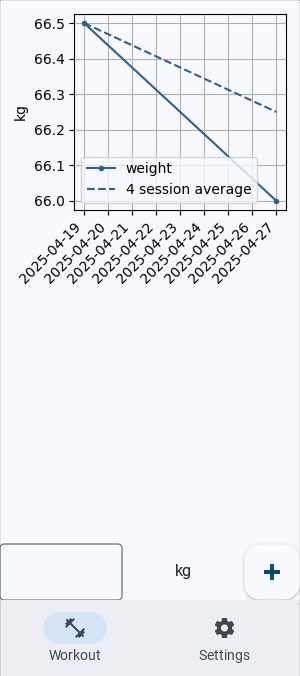
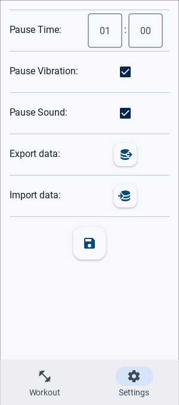

# Lean-Gym

A lean mobile app to track your workout progress. It is limited only to the most basic functionalities and all data is stored locally.

Written in Python using the Kivy and KivyMD frameworks.


## Use Case \& Background

Most gym apps do things I don't want them to do, such as collecting your data, being full of advertisements or limiting their functionalities unless you pay a subscription. Therefore, I made my own.

The app allows you to create and track your workouts. Data is being stored locally and can be exported and imported.


## How to Run

### On Your PC

To run the app on your pc, you need to install python and the packages listed in the 'requirements.txt' file. You can also do this using one pip command:
```
pip install -r requirements.txt
```

### On Your Mobile Phone

To run and deploy the app on both Android and iOS, you can use [Buildozer](https://github.com/iamklager/personal_finance_dashboard).


## Technologies Used

- Python: + Kivy, KivyMD, Matplotlib
- SQLite3
- Buildozer

## Functionality

On the app's home screen, you can start, add, edit and delete workouts.

During a workout, selecting an exercise will bring you to a screen displaying either your last session's sets as a table or this exercise's history as a chart, as well as the set's of your current session. After each set, you will enter a pause screen, displaying the countdown until the next exercise. You can always skip this. During each workout, you can also track your bodyweight, and view its history.

In the settings screen, you can adjust your countdown time, and whether or not your phone should vibrate or play a sound at the end of your pause. Here you can also export and import your data.


## Implementation Details

### Data Import \& Storage

All the data is stored using a local SQLite3 database.

### Data Processing

Not much to say here. It happens when it needs to happen and is done via Python and SQLite queries.

### Visualization

The UI was built in KivyMD, and the Matplotlib was used for the charts. Tables are custom widgets that use KivyMD's labels and dividers.


## Demo Screenshots

<p align = "center">
  
  
  
  <br>
  
  
  
</p>
